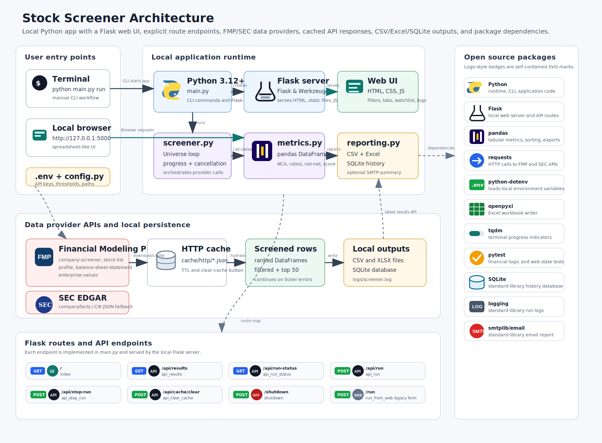

# Deep Value Stock Screener

A local, web-based Python application for screening U.S.-listed common stocks for deep value opportunities. It runs from Terminal, writes CSV and Excel reports, stores run history in SQLite, and serves a simple spreadsheet-like UI for filtering and sorting the latest results.

## Architecture



## Project Structure

```text
.
|-- config.py              # Environment and threshold configuration
|-- data_provider.py       # FMP primary provider and SEC EDGAR fallback
|-- metrics.py             # Financial metric calculations
|-- screener.py            # Screening and ranking workflow
|-- reporting.py           # CSV, Excel, SQLite, and optional email reports
|-- main.py                # CLI and local Flask web app
|-- templates/             # Web UI template
|-- static/                # Web UI CSS and JavaScript
|-- docs/                  # Architecture diagram
|-- tests/                 # Unit tests
|-- scripts/run_screener.sh
|-- setup.sh
|-- requirements.txt
`-- .env.example
```

Generated runtime files are written to `cache/`, `output/`, `logs/`, and `data/`.

## macOS Apple Silicon Setup

Install Homebrew if needed:

```bash
/bin/bash -c "$(curl -fsSL https://raw.githubusercontent.com/Homebrew/install/HEAD/install.sh)"
```

Install Python 3.12:

```bash
brew install python@3.12
```

Create the virtual environment and install dependencies:

```bash
cd /Users/derkok/git/stock_screener
chmod +x setup.sh scripts/run_screener.sh
./setup.sh
```

## Configuration

Copy `.env.example` to `.env` if `setup.sh` has not already done so:

```bash
cp .env.example .env
```

Important settings:

```text
FMP_API_KEY=your_fmp_key
SEC_USER_AGENT=DeepValueScreener/1.0 your_email@example.com
MIN_MARKET_CAP=100000000
MAX_MARKET_CAP_TO_NCA=2.0
MAX_TICKERS=
CACHE_TTL_HOURS=720
```

`MAX_TICKERS` can be set to a small number while testing the free API tier. Leave it blank for the full eligible universe.

## Manual Usage

Run the screener from Terminal:

```bash
cd /Users/derkok/git/stock_screener
source .venv/bin/activate
python main.py run
```

Or use the wrapper script:

```bash
./scripts/run_screener.sh
```

Start the local web UI:

```bash
source .venv/bin/activate
python main.py serve
```

Open [http://127.0.0.1:5000](http://127.0.0.1:5000). The UI shows the latest CSV output and lets you filter and sort like a simple spreadsheet.

For a quick API smoke test:

```bash
python main.py run --limit 25 --no-email
```

## Outputs

Each run generates:

- `output/all_companies.csv`
- `output/filtered_companies.csv`
- `output/filtered_companies_YYYYMMDD_HHMMSS.csv`
- `output/deep_value_screener_YYYYMMDD_HHMMSS.xlsx`
- `data/screener_history.sqlite3`
- `logs/screener.log`

The Excel workbook includes:

- All Companies
- Filtered Companies
- Top 50 Ranked
- Summary

## Universe Rules

The screener targets U.S.-listed common stocks on NYSE, NASDAQ, and NYSE American. It excludes obvious ETFs, funds, preferred shares, warrants, rights, units, ADRs, foreign companies, and common SPAC naming patterns. FMP is used as the primary source. SEC EDGAR companyfacts is used as a fallback for current assets, current liabilities, debt, and equity when feasible.

## Metrics

- Net Current Assets: `Current Assets - Current Liabilities`
- Current Ratio: `Current Assets / Current Liabilities`
- Market Cap / NCA: lower is cheaper; the default pass threshold is below `2.0`
- NCA / Market Cap: inverse of Market Cap / NCA
- NCA / Share: net current assets divided by shares outstanding
- Debt / NCA: lower is preferred
- Debt / Equity: used as a ranking tie-breaker when equity is available
- Net-Net Value: `Net Current Assets - Debt`
- Graham Net-Net: `Market Cap < NCA` and `Market Cap < Net-Net Value`
- Valuation Score: 0-100 score weighted toward low Market Cap / NCA, low EV / NCA, low debt, and strong liquidity

## Ranking

Companies are ranked by:

1. Lowest Market Cap / NCA
2. Highest Current Ratio
3. Lowest Debt / Equity

## Estimated Runtime and API Usage

Runtime depends on API limits and cache warmth. A first full run can take tens of minutes because the app retrieves per-ticker profile, quote, balance sheet, and enterprise value data while respecting rate limits. Later runs are faster because responses are cached locally for `CACHE_TTL_HOURS`.

Estimated first-run FMP calls are roughly:

```text
1 universe call + up to 4 calls per eligible ticker
```

Set `MAX_TICKERS=25` for quick tests.

## Optional Email Report

Set these values in `.env`:

```text
EMAIL_ENABLED=true
SMTP_HOST=smtp.example.com
SMTP_PORT=587
SMTP_USERNAME=user
SMTP_PASSWORD=your_smtp_password
SMTP_FROM=sender@example.com
SMTP_TO=recipient@example.com
SMTP_USE_TLS=true
```

Email is disabled by default and is also skipped by `python main.py run --no-email`.

## Troubleshooting

- `FMP_API_KEY is required`: copy `.env.example` to `.env` and confirm `FMP_API_KEY` is set.
- HTTP 429 responses: the free API tier is rate limited. The app retries with exponential backoff and uses local caching. Reduce `MAX_TICKERS` while testing.
- No filtered companies: deep net-current-asset opportunities are rare. Try inspecting `output/all_companies.csv` to confirm data is being collected.
- SEC fallback errors: set `SEC_USER_AGENT` to include a contact email.
- Import errors: activate the virtual environment with `source .venv/bin/activate` and reinstall with `python -m pip install -r requirements.txt`.

## Tests

```bash
source .venv/bin/activate
pytest
```
